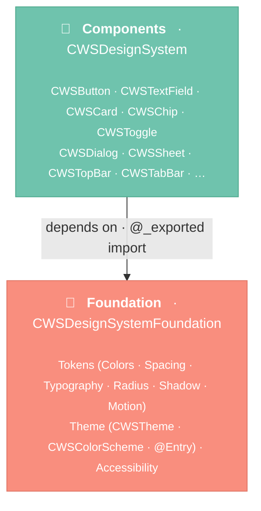
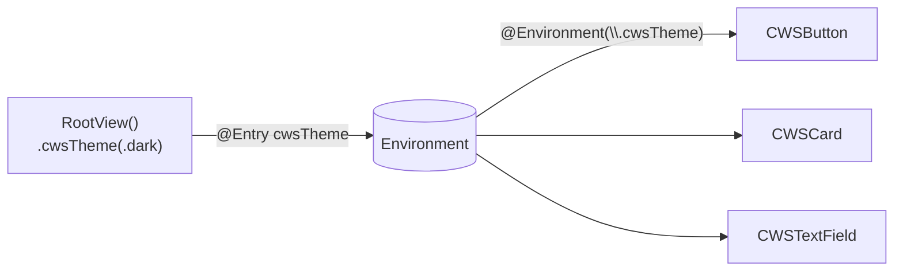

# Architecture

The design system is a **Swift Package** with two layered library targets. The split enforces a
one-way dependency: tokens and theming never depend on component composition.

## Layered architecture



- **`CWSDesignSystemFoundation`** — design tokens, the `CWSTheme` / `CWSColorScheme` model, the
  `@Entry`-backed environment, and accessibility helpers. **No component code, no dependencies.**
- **`CWSDesignSystem`** — the components. Depends on Foundation and **re-exports** it
  (`@_exported import`), so consumers need only `import CWSDesignSystem`.

!!! info "The dependency rule"
    Foundation must never import Components. Tokens/theme stay free of UI composition so they can be
    reasoned about and tested in isolation — and so a component can never sneak a circular reference
    into the token layer.

## Theming flows through the environment

There's no global singleton. The active theme is injected once and read by every component via the
SwiftUI environment:



This is why dark mode is automatic and a custom brand is one line — components resolve **semantic
roles** from the injected `CWSColorScheme`, never hardcoded colors. See [Theming](theming/colors.md).

## Repository layout

```
ios-design-system/
├─ Package.swift                      # 2 library targets + tests
├─ Sources/
│  ├─ CWSDesignSystemFoundation/      # Tokens · Theme (@Entry) · Accessibility
│  └─ CWSDesignSystem/                # Components + DocC catalog
├─ Tests/
│  ├─ CWSDesignSystemTests/           # Swift Testing
│  └─ CWSSnapshotTests/               # snapshot goldens (iOS sim)
├─ Gallery/                           # showcase app (XcodeGen)
└─ docs-site/                         # this MkDocs site
```
