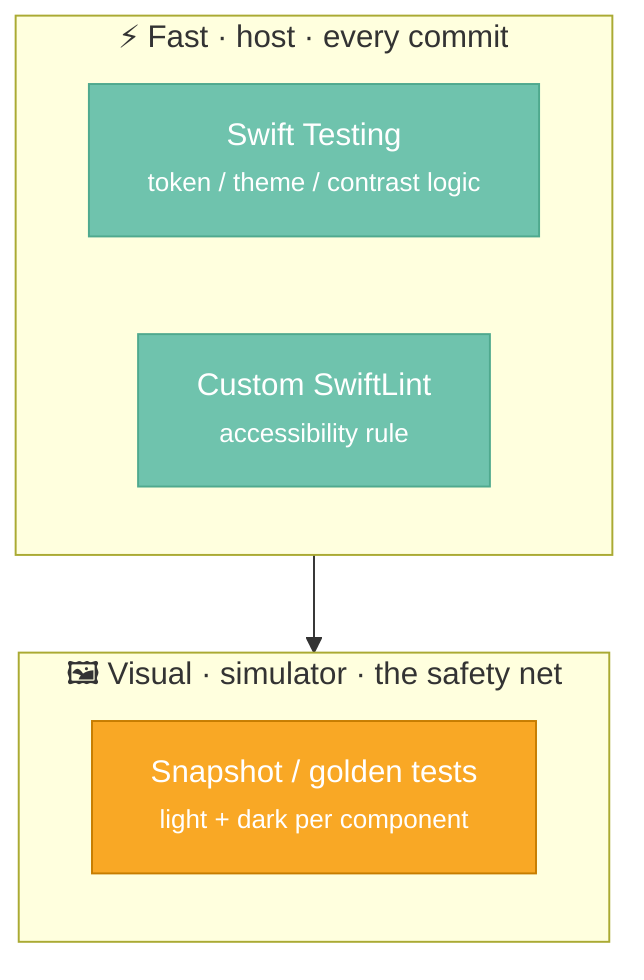

# Testing Strategy

A design system's output is **pixels and behavior**, not just return values. A button that returns
the right state but renders 3pt too narrow in dark mode is still a bug. So the strategy layers
several test types, each catching a different class of failure.



---

## 1. Unit tests — Swift Testing

Pure logic, fast, host-runnable: token relationships, theme/brand resolution, and WCAG contrast
math. Written with the modern Swift Testing framework (`import Testing`, `@Test`, `#expect`):

```swift
@Suite("Theme")
struct ThemeTests {
    @Test("Custom brand overrides the primary role")
    func brandOverride() {
        #expect(CWSTheme.brand(.purple).colorScheme.primary == .purple)
    }
}
```

```bash
swift test     # runs the unit suites on the macOS host
```

---

## 2. Snapshot (golden) tests

The highest-leverage test for a design system — the only thing that catches "looks wrong." Built on
[swift-snapshot-testing](https://github.com/pointfreeco/swift-snapshot-testing): each component is
rendered in **light and dark** and compared to a committed reference image.

```swift
assertSnapshot(of: UIHostingController(rootView: gallery(.dark)), as: .image)
```

```bash
# record goldens (first run / after an intentional visual change)
SNAPSHOT_TESTING_RECORD=all xcodebuild test -scheme CWSDesignSystem \
  -destination 'platform=iOS Simulator,name=iPhone 16'
```

Image snapshots use `UIHostingController`, so they run on an **iOS simulator** via `xcodebuild` —
not `swift test`. The snapshot dependency is gated to iOS so the host unit-test loop stays fast.

---

## 3. Accessibility, enforced

Accessibility isn't a separate suite — it's enforced at several layers so it can't regress:

| Layer | Mechanism | Catches |
|---|---|---|
| **Authoring** | `.accessibilityLabel`/traits; 44pt via `cwsMinimumTapTarget()`; Dynamic Type font tokens | designed-in a11y |
| **Static (lint)** | a custom SwiftLint rule flags SF Symbol images with no accessibility decision | callers/components that forget labels |
| **Visual (golden)** | dark-mode snapshots | contrast regressions |

The custom rule is the SwiftUI parallel of the Android `CWSMissingContentDescription` lint; it runs
as a CI step (`swiftlint lint --strict`).

---

## 4. What runs where

| Suite | Needs simulator | Frequency |
|---|---|---|
| Unit (Swift Testing) | no (host) | every commit |
| SwiftLint (a11y rule) | no | every commit |
| Snapshot goldens | yes | every PR |
